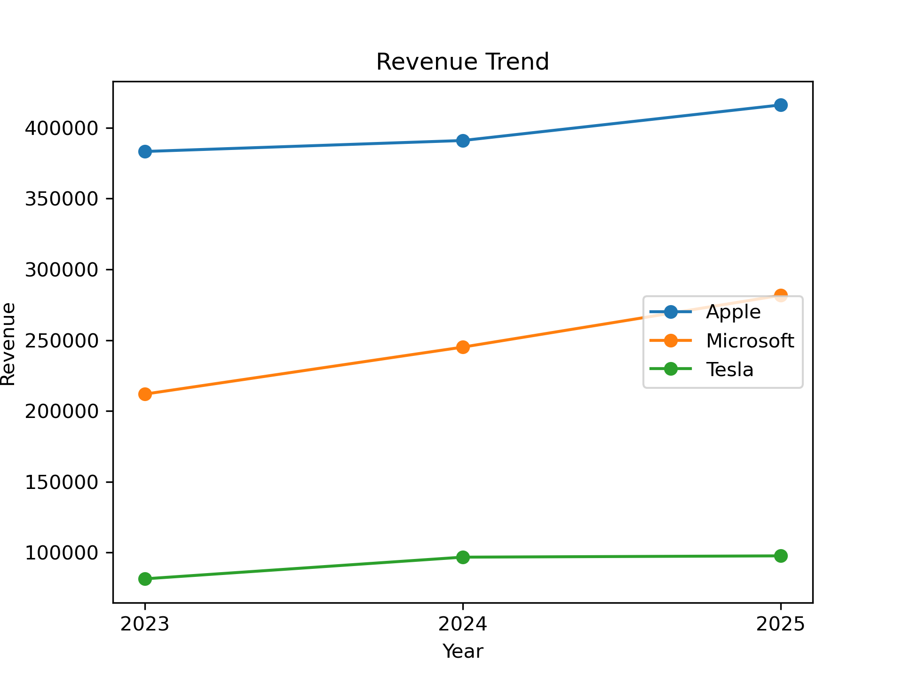
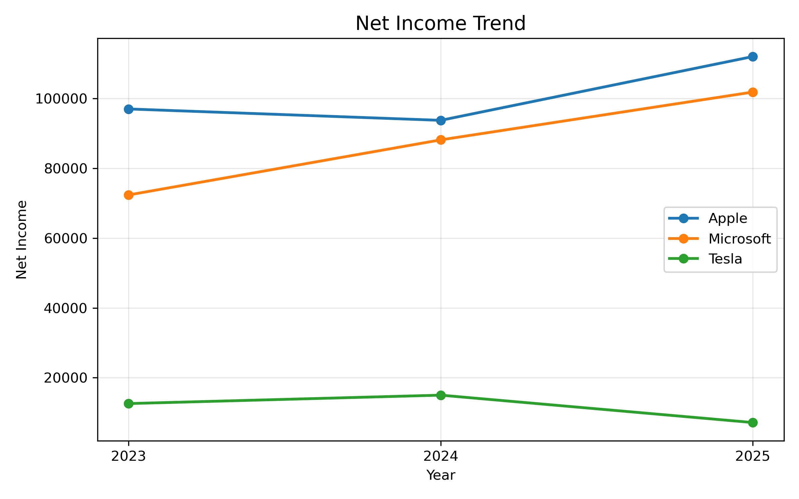
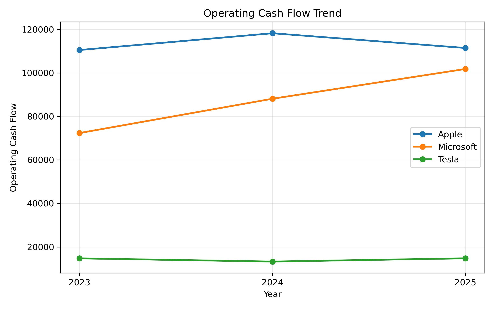

# Financial Analysis and Chatbot Prototype

## Project Overview

This project analyzes financial data from SEC EDGAR 10-K filings for three major companies:

- Microsoft
- Tesla
- Apple

The analysis covers fiscal years 2023–2025 and focuses on key financial metrics, trend analysis, and the development of a simple financial chatbot prototype.

The project demonstrates:
- Financial data extraction and cleaning
- Data analysis with pandas
- Financial trend visualization
- Basic chatbot development using Python

---

# Objectives

The main objectives of this project were:

1. Extract key financial metrics from SEC EDGAR filings
2. Analyze financial trends using Python and pandas
3. Visualize financial performance across companies
4. Build a prototype chatbot capable of answering predefined financial questions

---

# Financial Metrics Collected

The following financial metrics were extracted and analyzed:

- Revenue
- Net Income
- Total Assets
- Total Liabilities
- Operating Cash Flow (OCF)

Additional calculated metrics:
- Revenue Growth (%)
- Net Income Growth (%)
- OCF Growth (%)

---

# Technologies Used

- Python
- pandas
- matplotlib
- Jupyter Notebook

---

# Data Preparation

The original financial data was manually extracted from SEC EDGAR 10-K filings and organized into a CSV dataset.

The dataset was then cleaned and processed using pandas:
- Numeric formatting cleaned
- Year formatting standardized
- Growth metrics calculated
- Data sorted and prepared for analysis

Cleaned dataset file:

financial_data_cleaned.csv

# Data Analysis

The project includes:

- Company revenue analysis
- Net income trend analysis
- Operating cash flow analysis
- Year-over-year growth calculations
- Company comparisons
- Visualizations
- Revenue Trend

The revenue analysis shows:

Strong revenue growth for Microsoft
Stable growth for Apple
Slower growth trend for Tesla


Net Income Trend

Net income analysis indicates:

Apple generated the highest net income
Microsoft demonstrated strong profitability growth
Tesla showed more volatility in profitability


Operating Cash Flow Trend

Operating cash flow analysis highlights:

Strong and stable cash generation for Apple and Microsoft
Relatively stable but lower operating cash flow for Tesla


# Chatbot Prototype

A simple financial chatbot prototype was developed using Python.

The chatbot:

Loads the cleaned financial dataset
Responds to predefined financial questions
Uses if-elif logic for query matching
Returns financial metrics and growth statistics

Example supported queries:

What is Microsoft's revenue in 2025?
What was Tesla's revenue growth in 2025?
Which company had the highest revenue in 2025?
What was Apple's operating cash flow growth in 2025?

The chatbot also handles:

Unsupported queries
Exit commands
Example Chatbot Interaction
Ask a financial question:
what is apple's net income in 2025?

Response:
Apple's net income in 2025 was 112,010 million USD.


Ask a financial question:
what was tesla's revenue growth in 2025?

Response:
Tesla's revenue growth in 2025 was 0.95%.


Ask a financial question:
what's the best company

Response:
Sorry, I can only answer predefined financial questions.

# Project Structure
```
project/
│
├── financial_analysis.ipynb
├── chatbot.py
├── financial_data_cleaned.csv
├── plots/revenue_trend.png
├── plots/net_income_trend.png
├── plots/ocf_trend.png
└── README.md
```
# Limitations
The chatbot only supports predefined queries
No NLP or machine learning models were used
The project uses manually extracted financial data
The chatbot cannot process flexible natural language questions

# Conclusion

This project demonstrates the practical use of Python and pandas for financial analysis and basic chatbot development.

The final solution combines:

Financial data analysis
Trend visualization
Automated query responses
Simple user interaction

The project provides a foundation for future development of AI-powered financial analysis tools.
